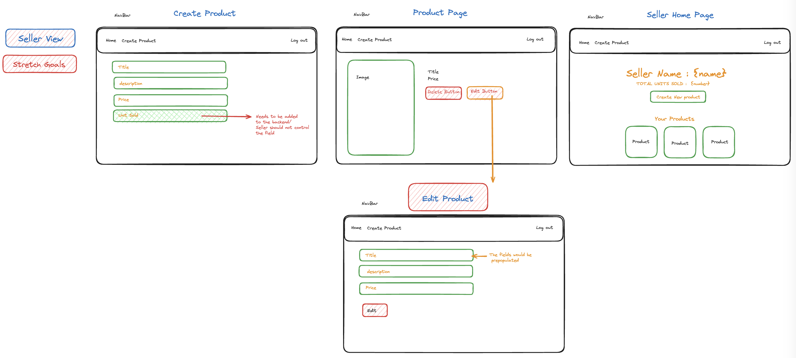
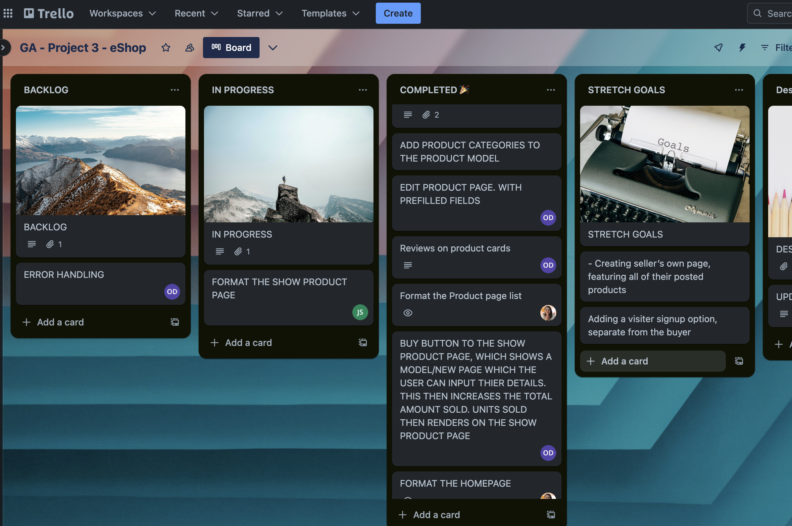
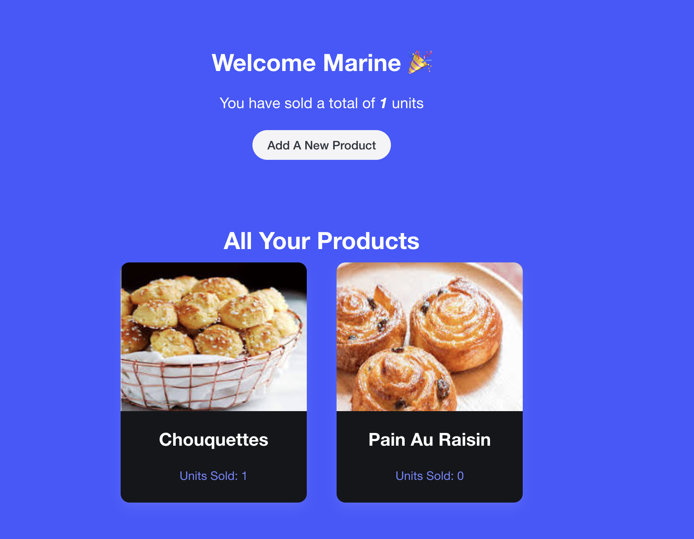
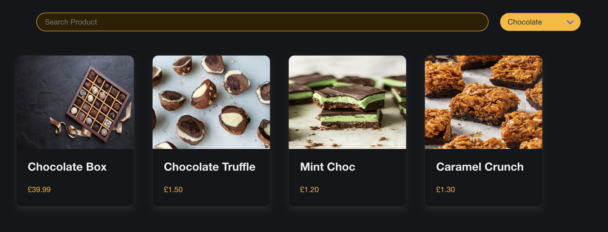
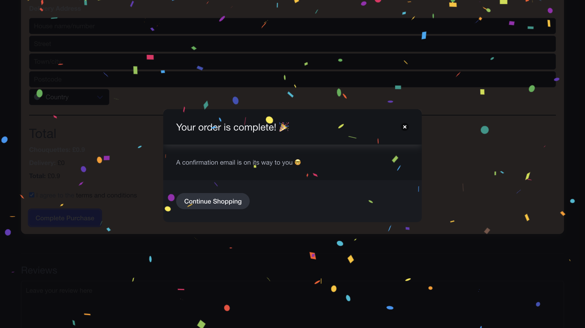

# Introduction

Meet our Etsy Gourmet pastry shop, where multiple sellers can share their delicious pastries, chocolates and cheeses.
This API enables a user to filter all the products displays on our e-shop as well as find products by category.
It also has an interface for visitors willing to be sellers, and share their products.
By creating our own API, we are able to pull the products from our database we were able to pull data as well as create a unique UX/UI design, according to our wireframe.
This project was done in partnership with 2 other people, Liv Darby and Jamie Sellerman. We had 5 days, to create a fully working API and create a frontend to feature the api's information, in an appealing way.

# Installation Instructions

Nothing much to do apart from click on our link and surf away on our lovely website :
**Discover our e-shop at : **https://gourmet-e-shop-front.netlify.app****

# Features :

Our e-shop is designed to cater to two distinct audiences:

- **Visitors/Potential Buyers:** Visitors can browse through our entire product range and filter items by category. Additionally, the search bar enables users to find specific products directly or within selected categories.
- **Seller Page View:** Sellers can view all their listed products, add new items, and track the number of units sold per product. A summary of total sales across all products is prominently displayed. Sellers also have the capability to edit or delete their listings.

# Technology Stack :

**Project Management**: Trello

**Frontend:**

- Vite for efficient project scaffolding
- React for building the user interface
- Axios for backend communication
- Bulma for CSS styling
- Netlify for frontend deployment

**Backend (API):**

- Express as the application framework
- MongoDB for the database
- Mongoose for data modeling, featuring unique validators and hidden properties
- Backend access: API Endpoint
- Database hosting with MongoDB Atlas
- Additional libraries and utilities: bcrypt for password hashing, and JWT for user authentication (tokens)

# Design and Planning

Our project, a gourmet e-shop akin to a food-centric Etsy, was brought to life over an ambitious 5-day sprint.

The initial two days were dedicated to foundational work on both the frontend and backend. We began with wireframing and employed Notion for project definition, swiftly deciding on creating an e-commerce platform. This stage was pivotal in brainstorming and wireframing, which led us to a clear demarcation of functionalities. Our goal was to ensure that visitors could smoothly navigate and make purchases, while sellers were equipped with comprehensive capabilities to manage their listings.

- **Wireframe for the Visitor View:** A blueprint showcasing the user journey of exploring and purchasing gourmet products. 
- **Wireframe for the Seller View:** A layout focused on the seller experience, highlighting product management and sales tracking. 

# Phase One: Unified Development Effort

On the backend, we set up a robust environment using Express and MongoDB, establishing foundational routes, controllers, and models to manage users and products efficiently. This setup included authentication mechanisms to secure sensitive operations and a seeding process to populate our database with initial data for development purposes.

Transitioning to frontend development, we utilized React to craft a seamless user interface, implementing dynamic components for product listings, user registration, and product management. This comprehensive approach allowed us to establish a solid foundation for our e-commerce platform, blending functionality with user experience to accommodate the diverse needs of our user base.

# Phase Two: Divide and Conquer

The final three days were characterized by more autonomous management. On day three, we allocated individual tasks using our Trello board.

- **Trello View:** A snapshot of our project management tool showcasing task allocation and progress tracking. 

## My Main Goals:

1. **Categorizing Products:** My first major task was to feature all product categories on the home page. Understanding the logic behind retrieving all categories, as opposed to a single category from each product, was challenging. MongoDB's documentation proved invaluable, offering a straightforward method to fetch categories using the `distinct` function.

   ```javascript
   // ROUTER
   router.route("/api/categories").get(getAllCategories);

   // Controller
   export async function getAllCategories(req, res) {
     try {
       const categories = await Products.distinct("category");
       res.send(categories);
     } catch (error) {
       res.status(500).send("Server error");
     }
   }
   ```

2. **Seller Home Page Development:** Creating a homepage for sellers to display their products and the total number of units sold was my next challenge. Collaborating with Liv, who implemented the functionality to increment units sold/product, significantly streamlined this process. Achieving this on the backend allowed for a more straightforward frontend implementation. Then after quite a bit a research and trial and error I managed to sum up  the total sales involved, by using a for loop. 

   ```javascript
   // Get ALL products/Seller (BACKEND)
   export async function getProductsbySeller(req, res) {
     try {
       const sellerId = req.params.userId;
       if (!sellerId) {
         return res.status(400).send({ message: "Please provide a Seller ID" });
       }
       const products = await Products.find({ user: sellerId });
       if (products.length === 0) {
         return res
           .status(404)
           .send({ message: "This seller has no products!" });
       }
       res.send(products);
     } catch (error) {
       console.error(error);
       res.status(500).send({ message: "error while getting products" });
     }
   }
   ```
   ```
   // FRONT_END - display sum total of products sold
   useEffect(() => {
    async function fetchProducts() {
      if (!user || !user._id) return; // Check if user and user._id are present
      console.log(user);
      const response = await fetch(`${baseUrl}/getProducts/${user._id}`);
      const data = await response.json();
      setProducts(data);

      let total = 0;
      for (const product of data) {
        total += Number(product.unitsSold);
      }
      setTotalUnitsSold(total);
    }

    fetchProducts();
  }, [user]);
  console.log(products);
   ```

   - **Seller Home Page:** Demonstrating the successful aggregation of sales data for seller products. 

3. **Enhancing Navigation with Categories:** My attempt to connect home page category buttons with the product list page's dropdown menu to filter by selected categories presented a significant hurdle. Despite employing the `useLocation` hook to pass category data between routes, I encountered functionality limitations that impeded user experience. This challenge underscored the complexities of dynamic data filtering and route management.

   - **Category Selection Success and Challenges:** A visual representation of the initial success in category-based product filtering, followed by the encountered limitations. 

4. **Comprehensive Styling Efforts:** The task of styling encompassed the home pages for both sellers and visitors, the product list, and the individual product card components. Utilizing the Bulma CSS framework posed a learning curve but ultimately enhanced the site's aesthetics and user interface.

Each of these goals presented unique challenges and learning opportunities, significantly contributing to my growth as a developer and to the project's overall success.

## Teammate Contributions

A heartfelt shoutout to my teammates for their stellar contributions, which brought a plethora of dynamic features to our website:

- **Interactive Purchase Flow:** We introduced a buy button that reveals a checkout menu, offering a seamless shopping experience. This feature not only facilitates the selection of a buyer's country for accurate shipping fee calculations but also updates the product's sold units in real-time, both in the database and on the seller's dashboard. Completing a purchase triggers a congratulatory modal, complete with digital confetti, celebrating the transaction.
- **Product Management Tools:** Sellers have access to intuitive delete and edit functionalities for their listings. The edit feature directs users to a pre-populated form, streamlining product updates.
- **Community Engagement through Reviews:** We've enabled visitors to leave reviews on products, fostering a community-driven feedback system. This addition was one of the more complex tasks, showcasing our commitment to a comprehensive user experience.
- **Enhanced Search Functionality:** The integration of a coordinated search bar and category dropdown enables users to navigate our product catalog with ease. This allows for both broad and targeted searches, enhancing the shopping experience.
- **Visualizing the Buying Experience:** Our website captures the joy of shopping with a visually engaging confirmation of purchase. 

## Planned Enhancements

Our journey doesn't stop here. We've identified key areas for future development, aiming to enrich the user experience further:

1. **Dedicated Seller Pages:** We're exploring the creation of individual pages for each seller, allowing visitors to view all products from their favorite creators in one place. This feature, while ambitious, promises to connect sellers and buyers more closely.
2. **Category-Based Navigation:** Enhancing the homepage to allow visitors to filter products by category with a single click is high on our priority list. Despite the challenges faced in implementing this feature, we are determined to realize this vision in future updates.
